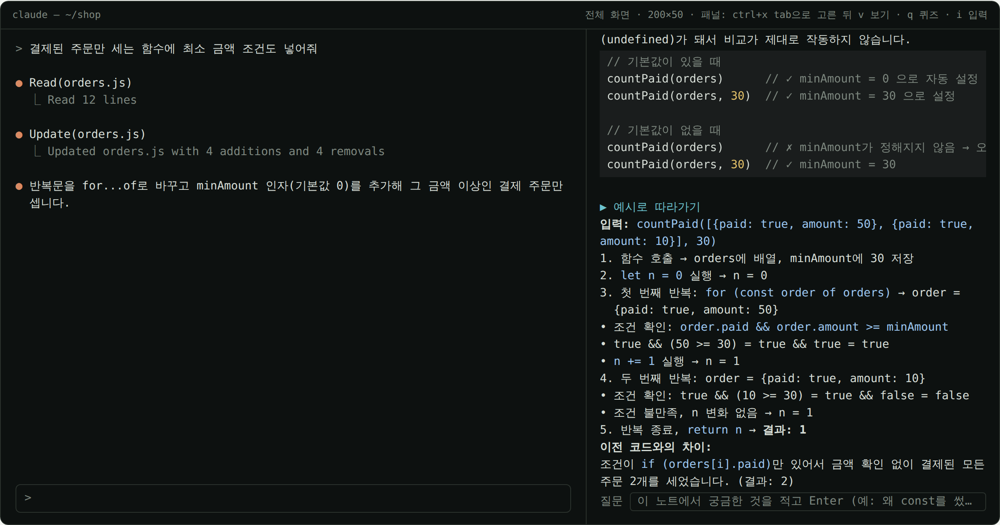
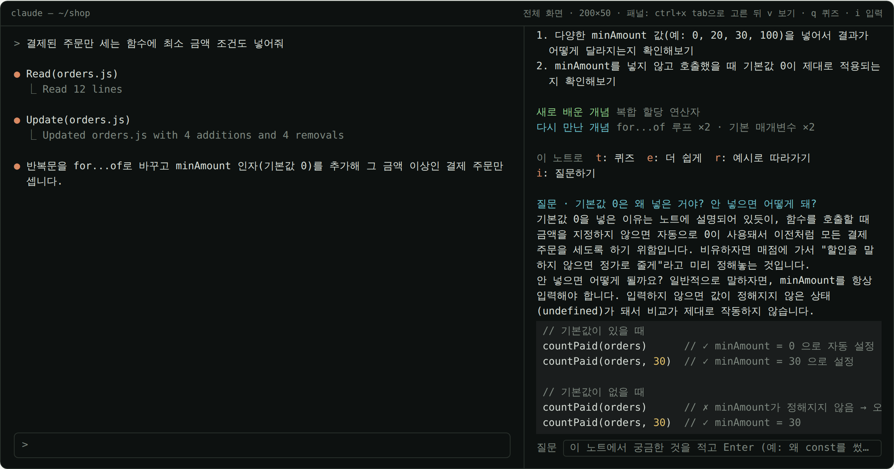
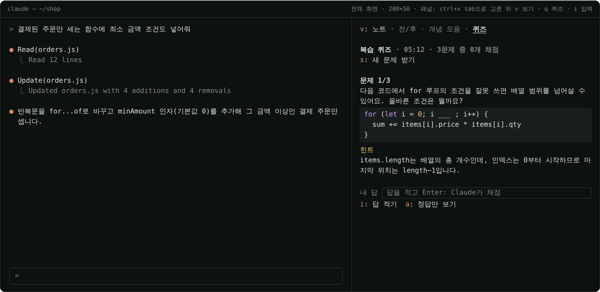

# learn-notes · 바이브코딩 학습 노트

Claude가 코드를 고치면 **바뀌기 전과 후**를 모아 두었다가, 턴이 끝날 때마다
"무엇이 왜 바뀌었고 무엇을 배울 수 있는지"를 **학습 노트**로 정리해 오른쪽 패널에 보여 주는
[Claude Code](https://code.claude.com) 모드(mod)입니다.
코드가 하던 일과 이제 하는 일을 **전/후 한 줄씩과 예시**로 보여 주고, 바뀐 줄에서는 **바뀐 낱말까지** 표시합니다.
노트에서 바로 묻거나 예시 하나로 코드를 따라가 보고, 배운 개념은 프로젝트를 넘어 쌓이며, 잊을 때쯤 **내가 만든 코드로** 복습 퀴즈를 냅니다.
답을 적으면 Claude가 채점해 줍니다.


<sub>사용 흐름을 56초로 보여 주는 데모입니다. 장면마다 모드의 테스트 키트로 엔진이 실제로 그린 화면을 이어 붙였고, 노트·질문의 답·퀴즈·힌트·채점·정리는 모두 이 모드의 프롬프트로 haiku가 실제로 쓴 글입니다.</sub>

> **English**: A Claude Code mod for learning while you vibe-code. Every turn in which Claude edits files,
> it collects the before/after diffs and has a small model (haiku by default) write a short study note:
> what the code did before and does now (with an example), why, concepts to learn, and what to try yourself.
> The before/after view marks changed lines and the very words that changed. Ask follow-up questions under a note,
> walk through the change on one example, and review what you learned with spaced-repetition quizzes built
> from your own code, graded by Claude. Notes are written in Korean.

| 노트 | 전/후 |
| --- | --- |
|  |  |
| **개념 모음** | **퀴즈: 내 답을 Claude가 채점** |
|  |  |

> **팀에 소개할 때**: [안내서 PDF](docs/team/learn-notes-guide.pdf)(모드 개념부터 설치·기능·활용 팁까지)와 [소개 PPT](docs/team/learn-notes-intro.pptx)(발표 대본 포함)를 나눠 주세요. 메신저에 붙여 넣을 소개 글은 [팀에 공유하기](#팀에-공유하기)에 있습니다.

## 빠른 시작

Claude Code **v2.1.287 이상**이 필요합니다 (`claude --version`).

1. Claude Code 안에서 두 줄을 입력해 설치합니다.

   ```
   /plugin marketplace add Owen-YC/learn-notes
   /plugin install learn-notes@learn-notes
   ```

2. Claude Code를 다시 시작하고 `/tui fullscreen`으로 전체 화면으로 바꿉니다. 패널이 대화 오른쪽에 붙으려면 전체 화면이어야 합니다.
3. `/learn`으로 패널을 엽니다.
4. 평소처럼 코딩을 요청합니다. 예: `hello.js에 이름을 받아 인사하는 함수를 만들어 줘`. Claude가 파일을 고친 턴이 끝나면 몇 초 안에 노트가 뜹니다.
5. **패널의 단축키는 `ctrl+x tab`으로 패널을 고른 뒤 누릅니다** (마우스로 패널을 클릭해도 됩니다). 버튼 앞에 키가 적혀 있습니다(`v: 전/후`).
   한/영이 한글 상태면 `q`가 `ㅂ`으로 들어가 단축키가 먹지 않으니, **영문 상태**에서 누르세요.

`/learn help`로 명령 목록이 나오면 제대로 켜진 것입니다.

- **업데이트**: `/plugin` → Installed → learn-notes → Update, 그다음 `/reload-plugins`. 터미널에서는 `claude plugin update learn-notes@learn-notes`
- **지우기**: `claude plugin uninstall learn-notes@learn-notes` (일지 파일 `~/.claude/learning-notes/`는 남습니다)
- **설치 없이 한 번 써 보기**: 이 저장소를 받아 `claude --plugin-dir <저장소 경로>`로 시작합니다.
- **Windows**: PowerShell에서 `irm https://claude.ai/install.ps1 | iex`로 Claude Code를 설치한 뒤 위와 똑같이 씁니다.
  Claude Code는 **작업할 폴더에서** 켜세요(`cd ~\practice` 뒤 `claude`). 관리자 PowerShell처럼 `C:\Windows\System32`에서 켜면 Claude가 파일을 임시 폴더에 만듭니다.
  이때도 노트는 생기고, 패널 맨 위에 작업 폴더에서 켜라는 안내가 뜹니다. `claude`를 못 찾으면 새 창을 열거나 `$env:Path += ";$HOME\.local\bin"`을 입력하세요.
- **클라우드 세션**(claude.ai 웹·앱에서 여는 Claude Code 세션)에서는 패널이 보는 화면에 뜨지 않을 수 있습니다. 이때 `/learn`은 마지막 노트를 대화창에 적어 주고, 퀴즈·질문도 명령(`/learn quiz 1 내 답`, `/learn ask 질문`)으로 다 됩니다.

## 하는 일

1. **모읍니다.** Claude가 `Edit`·`Write`, 또는 파일을 바꾸는 셸 명령(Bash, Windows에서는 PowerShell)을 쓸 때마다 바뀐 내용을 모읍니다. 턴이 도는 동안 패널 맨 위에 `● 작업 중: 파일 n개`가 보입니다.
2. **노트를 씁니다.** 턴이 끝나면 저렴한 모델(기본 `haiku`)이 바뀐 코드와 내 요청, Claude의 마지막 설명을 읽고
   다섯 칸짜리 노트를 씁니다: **한 줄 요약 · 무엇이 바뀌었나 · 왜 이렇게 바꿨을까 · 배울 개념 · 직접 확인해 볼 것**.
   "무엇이 바뀌었나"는 코드 설명 대신 **전**(하던 일) · **후**(이제 하는 일) · **예**(차이가 드러나는 입력과 결과) 세 줄로 씁니다.
3. **패널에서 봅니다.** 노트, 바뀐 낱말까지 표시한 전/후, 지금까지 배운 개념, 퀴즈를 오가며 봅니다. 지난 세션의 노트도 그대로 남아 있습니다.
4. **쌓습니다.** 노트는 날짜별 마크다운 일지(`~/.claude/learning-notes/`)에, 배운 개념은 프로젝트를 넘어 한 목록(`concepts.md`)에 쌓입니다.
5. **복습합니다.** 개념마다 다음 복습 날짜가 있어, 때가 되면 내가 만든 코드로 문제를 냅니다. 답을 적으면 Claude가 채점합니다.

## 패널 사용법

### 보기 바꾸기

패널 위쪽 줄에 보기 이름이 있습니다: **노트 · 전/후 · 개념 모음 · 퀴즈**. 지금 보는 것은 굵게 밑줄이 쳐집니다.

- `v`: 다음 보기로 (노트 → 전/후 → 개념 모음 → 노트). 퀴즈에서는 노트로 돌아갑니다.
- `q`: 어디서든 퀴즈로
- 보기 이름을 클릭하면 바로 그 보기로 갑니다.
- `p` · `n`: 이전 · 다음 노트 (지난 세션 노트까지)
- `w`: 노트를 다시 씁니다. 다시 쓰다 실패하면 원래 노트는 그대로 둡니다.

### 전/후: 무엇이 달라졌는지 한눈에

노트의 **무엇이 바뀌었나**는 코드가 하던 일(`− 전`, 빨강)과 이제 하는 일(`+ 후`, 초록), 그 차이가 드러나는 예(`→ 예`)를 한 줄씩 보여 줍니다.

**전/후** 보기는 맨 위에 그 세 줄을 다시 보여 주고, 바뀐 곳마다 원래 코드(전)와 바뀐 코드(후)를 파일의 줄 번호 그대로 놓습니다.

- 바뀌지 않은 줄은 흐리게, 바뀐 줄은 앞에 `−`(전) · `+`(후)를 붙입니다.
- 한 줄을 고친 것이면 **그 줄에서 바뀐 낱말만 굵은 색**으로 표시합니다. 예: `var n = 0` → `let n = 0`에서는 `var`와 `let`만.
- 거의 새로 쓴 줄은 줄 전체를 색으로, 새로 만든 파일은 코드 그대로 보여 줍니다.

맨 위 그림의 "전/후"가 이 보기입니다.

### 노트 아래에서 바로

노트 맨 아래 `이 노트로` 줄에서 이어 갑니다.

- `t` **퀴즈**: 방금 읽은 노트의 개념만으로 문제를 받습니다.
- `e` **더 쉽게**: 문장을 짧게, 용어를 일상어로, 개념마다 일상의 비유를 넣어 다시 씁니다. `w`로 원래 수준으로 돌아갑니다.
- `r` **예시로 따라가기**: 예시 입력 하나로 바뀐 코드를 한 단계씩 따라갑니다. 단계마다 변수 값이 어떻게 바뀌는지, 바뀌기 전 코드였다면 어디서 결과가 갈리는지 짚어 줍니다.
- `i` **질문하기**: 노트 아래 질문칸에 궁금한 것을 적고 Enter. 그 노트와 코드를 근거로 짧게 답하고, 답은 노트 아래에 남습니다.
  이어서 물으면 앞의 질문과 답을 읽고 답합니다. 대화창의 Claude에게 묻는 것과 달리 코드를 고치지 않고, 저렴한 모델이 답합니다.

| 예시로 따라가기 (`r`) | 노트에 질문 (`i`) |
| --- | --- |
|  |  |

### 퀴즈 풀기

`q`로 퀴즈를 열고 `s`로 문제를 받습니다(최대 3문제, 모델 호출 한 번). 복습할 때가 된 개념부터, 그 개념을 처음 배운 노트의 **내 코드**를 보여 주며 묻습니다.

| 키 | 하는 일 |
| --- | --- |
| `s` | 문제 받기 · 새 문제 받기 |
| `i` | 답 적기: 입력칸에 답을 적고 **Enter**. Claude가 정답과 비교해 **맞힘 · 거의 맞음 · 틀림**과 한두 문장 피드백을 줍니다 |
| `h` | 힌트: 답을 말하지 않고 떠올릴 실마리만 보여 줍니다 |
| `a` | 정답만 보기: 머릿속으로 답해 본 뒤 봅니다. 그다음 `o`(맞혔어요) · `x`(틀렸어요)로 스스로 채점합니다 |
| `f` | 채점 바꾸기: Claude의 채점이 이상하면 맞힘 ↔ 틀림을 바꿉니다. 복습 단계도 처음부터 그렇게 채점한 것처럼 돌아갑니다 |

채점한 문제는 위에 `✓ 맞힘` · `△ 거의 맞음` · `✗ 틀림` 한 줄로 남고, Claude가 채점한 문제는 다음 문제를 채점할 때까지 피드백·내 답·정답이 펼쳐져 있습니다.
퀴즈와 채점은 저장되므로 Claude Code를 다시 켜도 이어서 풉니다. 모바일 앱은 입력칸이 없어 `a`·`o`·`x`로 풉니다.



### 간격 반복 복습

배운 개념은 **잊을 때쯤** 다시 나옵니다. 맞힐 때마다 간격이 늘어납니다.

| 단계 | 0 | 1 | 2 | 3 | 4 | 5 |
| --- | --- | --- | --- | --- | --- | --- |
| 다음 복습 | 1일 뒤 | 3일 뒤 | 7일 뒤 | 14일 뒤 | 30일 뒤 | 60일 뒤 |

- 복습할 때가 된 개념을 **맞히면** 한 단계 오릅니다. 때가 되기 전에 맞힌 것이나 같은 날 다시 맞힌 것은 단계를 그대로 두고 그날부터 다시 셉니다.
- **거의 맞으면** 한 단계 내려갑니다(조금 더 빨리 다시 나옵니다).
- **틀리면** 0단계로 돌아가 바로 다음 퀴즈 맨 앞에 나옵니다.
- 퀴즈를 아직 안 본 개념은 노트에서 다시 만난 횟수만큼 단계가 올라 있는 것으로 칩니다.
- 복습할 개념이 있으면 프롬프트 아래 상태줄에 `학습 노트 · 복습할 개념 3개 · /learn 패널에서 q`가 뜹니다(설정 `reviewReminder`로 끕니다).

### 개념 모음과 학습 기록

- 노트의 "배울 개념"을 프로젝트를 넘어 모읍니다. 개념마다 만난 횟수, 최근에 만난 날, 다음 복습 날짜, 최근 설명, 그 개념이 나온 노트(누르면 그 노트로)가 있습니다.
- 노트 아래에는 그 노트에서 `새로 배운 개념`과 `다시 만난 개념 for...of 반복문 ×2`가 나뉘어 나옵니다.
- 이미 배운 개념 이름을 모델에 알려 주므로 같은 개념은 같은 이름으로 쌓입니다. "구조 분해 할당 (Destructuring)"과 "구조 분해 할당"처럼 표기만 다른 이름은 한 개념으로 셉니다. 그래도 갈라졌으면 `/learn merge`로 합칩니다.
- 개념 모음 맨 위에 **연속 학습일**, 최근 7일 노트 수, 퀴즈 정답 수가 한 줄로 나옵니다. 날짜별 기록은 최근 120일을 모든 프로젝트 합산으로 남깁니다.

### Anki로 내보내기

`/learn anki`가 일지 폴더에 `learn-notes-anki.txt`를 씁니다. [Anki](https://apps.ankiweb.net) 데스크톱에서 **파일 → 가져오기**로 고르면 `learn-notes` 덱에 들어갑니다.
카드 앞면은 퀴즈 문제(또는 개념 이름), 뒷면은 답과 개념입니다. 다시 내보내 가져와도 앞면이 같은 카드는 늘지 않고 고쳐집니다. 휴대폰 AnkiDroid·AnkiMobile은 동기화하면 같이 보입니다.

## /learn 명령

한글로도 됩니다: `/learn 퀴즈` · `개념` · `정리` · `기록` · `질문` · `찾기` · `일지` · `도움말`.

| 명령 | 하는 일 |
| --- | --- |
| `/learn` | 학습 노트 패널 열기 (패널을 띄울 수 없는 화면이면 마지막 노트를 대화창에) |
| `/learn quiz` | 복습할 개념으로 문제 받기 (내 코드로 묻습니다) |
| `/learn quiz 1 내 답` | 1번 문제에 답을 적어 Claude에게 채점받기. 다음 문제와 막혔을 때 볼 것을 알려 줍니다 |
| `/learn quiz 문제` | 지금 퀴즈의 문제를 다시 보기 (새로 만들지 않습니다) |
| `/learn quiz 힌트` | 아직 안 푼 문제들의 힌트 |
| `/learn quiz 정답` | 정답 보기. 채점은 하지 않습니다 |
| `/learn quiz 맞음 1 3` · `틀림 2` | 정답을 본 뒤 스스로 채점. 이미 채점한 문제도 바꿉니다(복습 단계도 함께) |
| `/learn concepts` | 지금까지 배운 개념과 다음 복습 날짜 |
| `/learn recap` | 오늘 배운 것 정리(한 일 · 핵심 개념 · 헷갈리기 쉬운 것 · 다음에 해 볼 것). `어제` · `이번주` · `최근 7일` · `2026-10-03`도 됩니다. 정리는 일지에 남습니다 |
| `/learn stats` | 연속 학습일, 최근 7일 노트·개념·퀴즈, 최근 30일 정답률, 날짜별 막대 |
| `/learn ask 질문` | 패널에서 고른 노트(없으면 마지막 노트)에 대해 묻기. 답은 패널의 노트 아래와 일지에도 남습니다 |
| `/learn last` | 마지막 노트를 대화창에 |
| `/learn find 말` | 모든 프로젝트의 노트에서 요청·내용·파일 이름·개념으로 찾기 |
| `/learn day` | 오늘 노트 목차(`어제` · `2026-10-03`도 됩니다). `/learn days`는 일지가 있는 날짜 |
| `/learn anki` | 퀴즈 문제와 개념을 Anki 카드 파일로 |
| `/learn merge A = B` | 이름만 다른 같은 개념 합치기(A를 B로). 거꾸로(`B = A`) 하면 되돌립니다 |
| `/learn save` | 아직 파일에 없는 노트와 개념 모음 저장(자동 저장을 껐을 때) |
| `/learn clear` | 이 프로젝트의 노트 비우기(일지 파일과 개념 모음은 그대로) |
| `/learn help` | 명령 목록 |

## 팀에 공유하기

팀 메신저에 그대로 붙여 넣을 수 있는 소개 글입니다.

```text
안녕하세요! 바이브코딩하면서 공부도 같이 되도록 Claude Code 모드를 하나 만들었어요. 이름은 learn-notes예요 📒

🤔 모드(MOD)가 뭐예요?
Claude Code에 기능을 덧붙이는 확장 프로그램이에요. 크롬 확장 프로그램처럼 한 번 설치하면 Claude Code 안에 새 명령과 패널이 생겨요.

✨ learn-notes가 해 주는 것
• Claude가 코드를 고치면, 턴이 끝날 때 "무엇이 왜 바뀌었고 무엇을 배울 수 있는지"를 학습 노트로 정리해 오른쪽 패널에 보여 줘요
• 코드가 전에 하던 일과 이제 하는 일을 한 줄씩, 차이가 드러나는 예시와 함께 보여 줘요
• 바뀌기 전/후 코드를 나란히 놓고, 바뀐 줄과 바뀐 낱말까지 색으로 표시해 줘요
• 노트를 보다 모르는 게 있으면 노트 아래에서 바로 물어보고, 예시 하나로 코드를 한 단계씩 따라가 볼 수 있어요
• 배운 개념은 프로젝트가 달라도 계속 쌓이고, 잊을 때쯤 "내가 만든 코드"로 복습 퀴즈를 내요. 답을 적으면 Claude가 채점해 줘요
• 노트는 날짜별 일지(마크다운 파일)로도 저장돼서 나중에 다시 볼 수 있어요

🛠 설치 (2분)
Claude Code v2.1.287 이상이 필요해요 (claude --version 으로 확인)
1) Claude Code 안에서 아래 두 줄 입력
   /plugin marketplace add Owen-YC/learn-notes
   /plugin install learn-notes@learn-notes
2) Claude Code를 다시 켜고 /tui fullscreen (전체 화면이어야 패널이 오른쪽에 붙어요)
3) /learn 으로 패널 열기 → 평소처럼 코딩을 요청하면 몇 초 뒤 노트가 떠요
4) /learn help 에 명령 목록이 나오면 성공!

💡 알아 두면 좋은 것
• 패널 단축키는 ctrl+x 다음 tab으로 패널을 고른 뒤 눌러요 (마우스로 패널을 클릭해도 돼요)
  v 보기 바꾸기 · r 예시로 따라가기 · i 질문하기 · q 퀴즈
  한/영은 영문 상태로 두고 눌러요 (한글 상태면 q가 ㅂ으로 들어가 안 먹어요)
• Windows는 작업 폴더에서 켜 주세요: cd ~\practice 후 claude
  (관리자 PowerShell의 기본 위치인 System32에서 켜면 파일이 임시 폴더에 생겨요)
• 노트는 기본으로 가장 저렴한 haiku 모델이 써요. 설명 수준(초급/중급/고급)이나 자동 노트 끄기는 /config 의 learn-notes 항목에서 바꿀 수 있어요
• 한글 명령도 돼요: /learn 퀴즈 · 개념 · 정리 · 질문 · 도움말

📎 자세한 설명
• 안내서 PDF (모드 개념부터 기능·활용 팁까지)
  https://github.com/Owen-YC/learn-notes/blob/main/docs/team/learn-notes-guide.pdf
• 소개 PPT (바로 내려받기)
  https://github.com/Owen-YC/learn-notes/raw/main/docs/team/learn-notes-intro.pptx
• 저장소·사용 데모 영상
  https://github.com/Owen-YC/learn-notes

써 보다가 막히거나 이상한 게 보이면 화면을 캡처해서 편하게 보내 주세요. 이런 기능 있으면 좋겠다는 의견도 환영이에요 🙌
```

짧게 다시 알릴 때:

```text
📒 learn-notes: Claude가 코드를 고칠 때마다 무엇이 어떻게 달라졌는지 학습 노트로 보여 주고, 내가 만든 코드로 복습 퀴즈까지 내 주는 Claude Code 모드예요.

설치: Claude Code에서
/plugin marketplace add Owen-YC/learn-notes
/plugin install learn-notes@learn-notes
→ 다시 켜고 /tui fullscreen → /learn

안내서 PDF: https://github.com/Owen-YC/learn-notes/blob/main/docs/team/learn-notes-guide.pdf
소개 PPT: https://github.com/Owen-YC/learn-notes/raw/main/docs/team/learn-notes-intro.pptx
막히면 화면 캡처해서 보내 주세요!
```

## 설정

`/config`의 `learn-notes.…` 항목에서 바꿉니다. 터미널에서는 `claude plugin configure learn-notes@learn-notes`.

| 항목 | 기본값 | 설명 |
| --- | --- | --- |
| `autoNote` | 켜짐 | 끄면 바뀐 코드만 모으고 노트는 패널에서 `w`로만 씁니다 (모델 비용 0) |
| `model` | `haiku` | `haiku` · `sonnet` · `opus`. 노트·퀴즈·채점·질문에 씁니다 |
| `level` | `beginner` | `beginner`(용어를 쉬운 말로) · `intermediate` · `advanced`(설계·트레이드오프) |
| `autoOpen` | 켜짐 | 첫 노트에서 패널 자동 열기. 전체 화면 터미널에서 144칸 이상일 때 열리고, 패널을 `/learn`으로 연 적이 있으면 110칸부터 열립니다(이전 세션 포함). 패널을 손으로 닫으면(`ctrl+x x`) 다시 144칸부터입니다. 그보다 좁으면 토스트로 알립니다 |
| `autoSave` | 켜짐 | 노트를 마크다운 일지로 저장. `/learn recap`·`day`도 이 일지를 읽습니다 |
| `reviewReminder` | 켜짐 | 복습할 개념이 있으면 상태줄에 개수를 띄움 |
| `saveDir` | (비움) | 비우면 `~/.claude/learning-notes`. `~`로 시작하면 홈 폴더 기준 |

## 노트가 안 생겨요

하나씩 확인해 보세요.

1. **그 턴에 파일이 바뀌었나요?** 질문에 답만 한 턴은 노트가 없습니다. Claude가 파일을 만들거나 고친 턴에만 생깁니다.
2. **패널이 열려 있나요?** `/learn`으로 엽니다. 대화 오른쪽에 붙으려면 `/tui fullscreen`(전체 화면)이어야 합니다. 아니면 프롬프트 위에 열리고, 노트가 준비되면 토스트로 알려 줍니다.
3. **단축키가 안 먹나요?** `ctrl+x tab`으로 패널을 먼저 고르세요. 마우스로 클릭해도 됩니다.
   `ㅂ`·`ㅍ` 같은 글자가 대화 입력칸에 찍힌다면 한/영이 한글 상태입니다. 한글 상태에서는 `q`가 `ㅂ`, `v`가 `ㅍ`으로 들어가 단축키가 먹지 않고 패널 선택도 풀립니다.
   한/영 키로 영문 상태로 바꾼 뒤 `ctrl+x tab`으로 다시 고르세요.
4. **설치한 폴더가 다른가요?** 다른 폴더에서 설치했다면 `/plugin`의 Installed 탭에 learn-notes가 있는지 보고, 없으면 빠른 시작의 두 줄을 다시 입력합니다.
5. **노트 칸이 빨간 글씨인가요?** 이유가 적혀 있습니다. `서버가 붐빕니다` · `요청 한도에 걸렸습니다`는 잠시 뒤 `w`로 다시 쓰고, `모델을 부를 수 없습니다`는 `/config`에서 다른 모델을 고르세요. `로그인이 필요합니다`는 `/login`.
6. **임시 폴더의 파일만 바뀌었나요?** 프로젝트 밖 임시 폴더의 파일은 Claude의 작업 파일로 보고 빼놓습니다(아래 "자세히").

## 비용과 개인정보

- 파일을 바꾼 턴마다 모델 호출이 **한 번** 일어납니다(기본 haiku, 노트 하나에 바뀐 코드 최대 약 14,000자). 퀴즈 받기·답 채점·질문·따라가기·더 쉽게·정리는 할 때마다 한 번씩입니다. `/learn stats`·`anki`·`concepts`는 모델을 부르지 않습니다.
- 호출은 지금 쓰는 Claude Code 계정으로 나갑니다. 바뀐 코드와 요청 문장이 그 호출에 실리므로, 비밀값이 든 파일을 다룬다면 `autoNote`를 끄세요.
- 노트·일지·개념 모음·학습 기록·퀴즈는 모두 내 컴퓨터에만 저장됩니다.

## 자세히

<details>
<summary>무엇을 모으고 무엇을 빼나</summary>

- 셸 명령은 Claude Code가 diff를 주면 그것을 쓰고, 주지 않으면(Windows의 PowerShell 등) 명령에 이름이 나온 파일을 명령 전후로 읽어 줄 단위로 비교합니다. `cd`·`Set-Location`으로 옮긴 폴더, `~`·`$env:USERPROFILE`, Windows 경로와 CRLF 줄끝을 읽습니다. 스크립트 안에서만 쓰는 파일처럼 명령에 이름이 드러나지 않는 변경은 잡지 못합니다.
- 이번 턴에 새로 만든 파일을 같은 턴에 다시 고치면 "새 파일" 하나로 마지막 내용을 보여 줍니다.
- 빼는 것: Claude가 스스로 쓰는 계획·메모리(`~/.claude/plans`, `~/.claude/projects`), 프로젝트 밖 임시 폴더(`/tmp`, `TMPDIR` 등)의 작업 파일, `git stash`·`checkout`·`restore`·`reset`·`pull`·`merge` 같은 명령이 디스크에 되돌리거나 가져온 내용.
  단, Claude Code를 `C:\Windows\System32`나 드라이브 루트 같은 시스템 폴더에서 켰다면 Claude가 코드를 임시 폴더에 만들므로 그 파일은 담습니다.
- 노트의 "요청"은 사람이 보낸 요청입니다. 작업 알림이나 다른 세션의 메시지로 시작한 턴은 마지막 요청에 "(이어서)"를 붙입니다.

</details>

<details>
<summary>어디에 얼마나 쌓이나</summary>

- **일지**: `~/.claude/learning-notes/<날짜>_<프로젝트>_<경로 표식>.md`. 노트, 바뀐 코드(diff), 질문과 답, 정리가 쌓입니다. 경로 표식은 프로젝트 경로에서 만든 짧은 글자라, 폴더 이름이 같은 다른 프로젝트와 섞이지 않습니다. 하루 파일이 3MB를 넘으면 `~2.md`, `~3.md`로 이어집니다.
- **지난 세션 노트**: 프로젝트마다 최근 노트 30개(최근 프로젝트 12개까지)를 Claude Code의 플러그인 저장소(`~/.claude/plugins/store/`)에 보관합니다. 모두 합쳐 약 2MB를 넘으면 오래 안 쓴 프로젝트부터 덜어 냅니다.
  같은 프로젝트에서 세션 둘을 동시에 써도 서로의 노트를 지우지 않고, 같은 노트는 더 나중에 고친 쪽이 남습니다. `/cd`로 프로젝트를 옮기면 패널도 그 프로젝트의 노트로 바뀝니다.
- **개념 모음**: 최근에 만난 400개. 일지 폴더의 `concepts.md`에 표로도 남습니다.
- **퀴즈 문제**: 최근 300개(`/learn anki`용).
- `claude -p`(한 번 실행하고 끝나는 방식)에서는 노트를 다 쓰고 나서 끝납니다. 그만큼(보통 10초 안팎) 실행이 길어집니다.

</details>

## 개발

```
.claude-plugin/plugin.json        매니페스트 · 설정 항목(userConfig)
.claude-plugin/marketplace.json   이 저장소를 마켓플레이스로 쓰게 하는 목록
hooks/hooks.json                  훅 모듈 위치
hooks/register.tsx                훅: 변경 수집 · 노트 작성 · 패널 · /learn
hooks/notes.ts                    순수 함수: diff 자르기·되읽기 · 전/후와 바뀐 낱말 · 프롬프트 · 일지 · 간격 반복 · Anki
types/index.d.ts                  $.state 계약
tests/*.test.ts                   claude plugin test로 도는 검사
```

- 검사: `claude plugin validate .` · `claude plugin test .`
- 고쳐 보며 쓰기: `claude --plugin-dir .`로 열면 파일을 고칠 때마다 대화 중에도 다시 불러옵니다.
- 타입 검사: `tsconfig.json`이 가리키는 `.claude-plugin/types/`(Claude Code가 모드 작업 폴더에 만들어 두는 타입 정의)가 있을 때 `npx tsc --noEmit -p .`

버그나 제안은 [Issues](https://github.com/Owen-YC/learn-notes/issues)에 남겨 주세요.

## 라이선스

[MIT](LICENSE)
