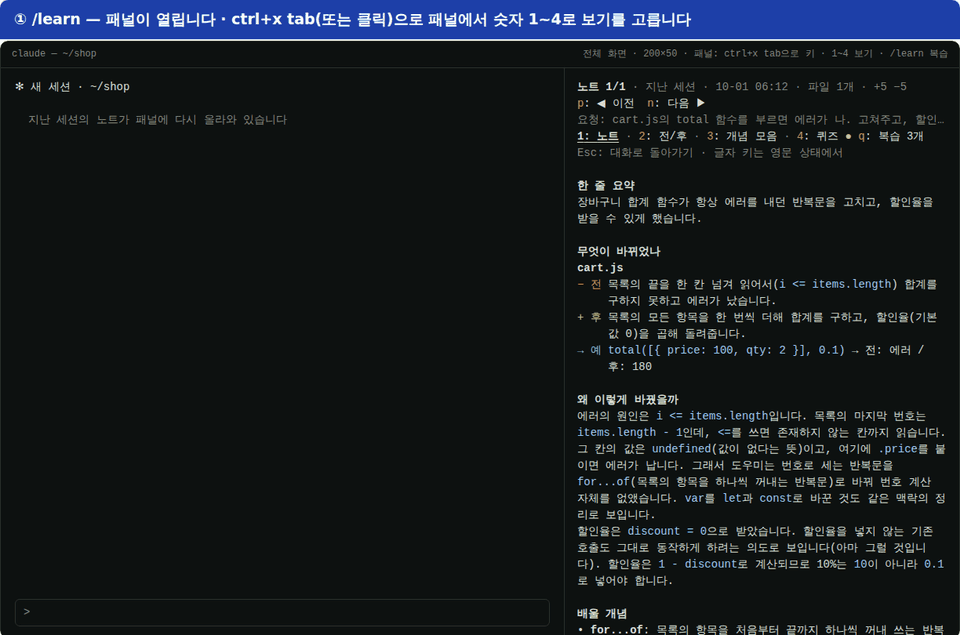
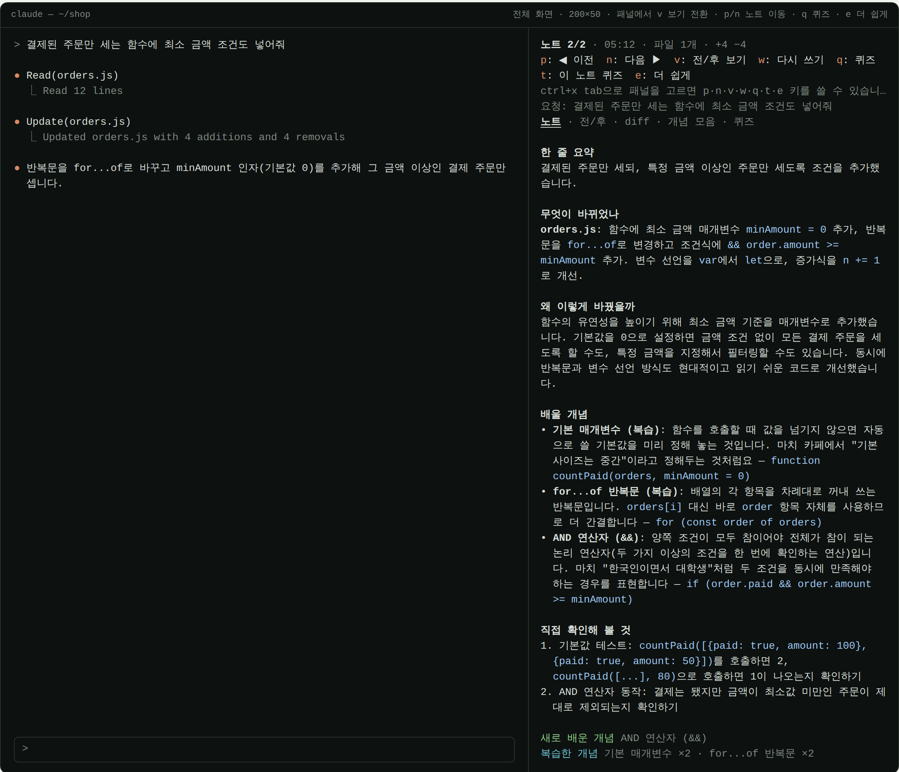
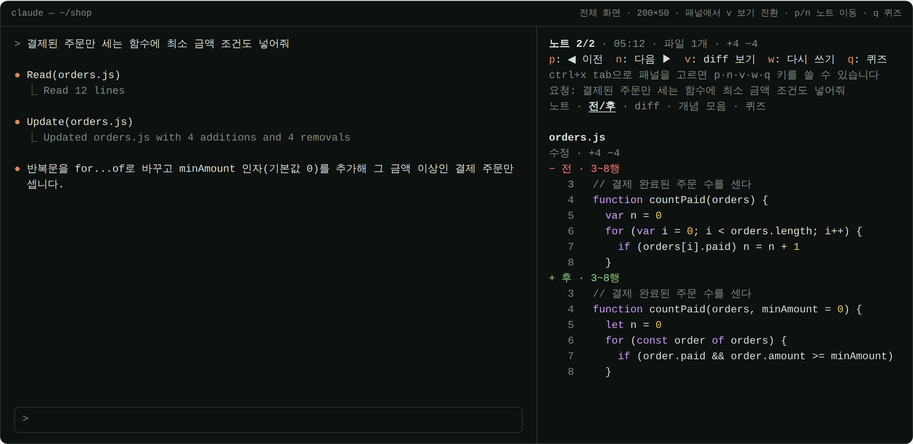
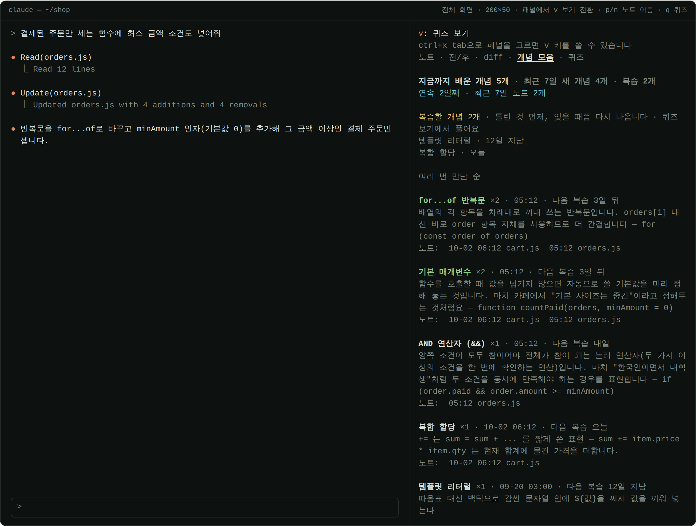
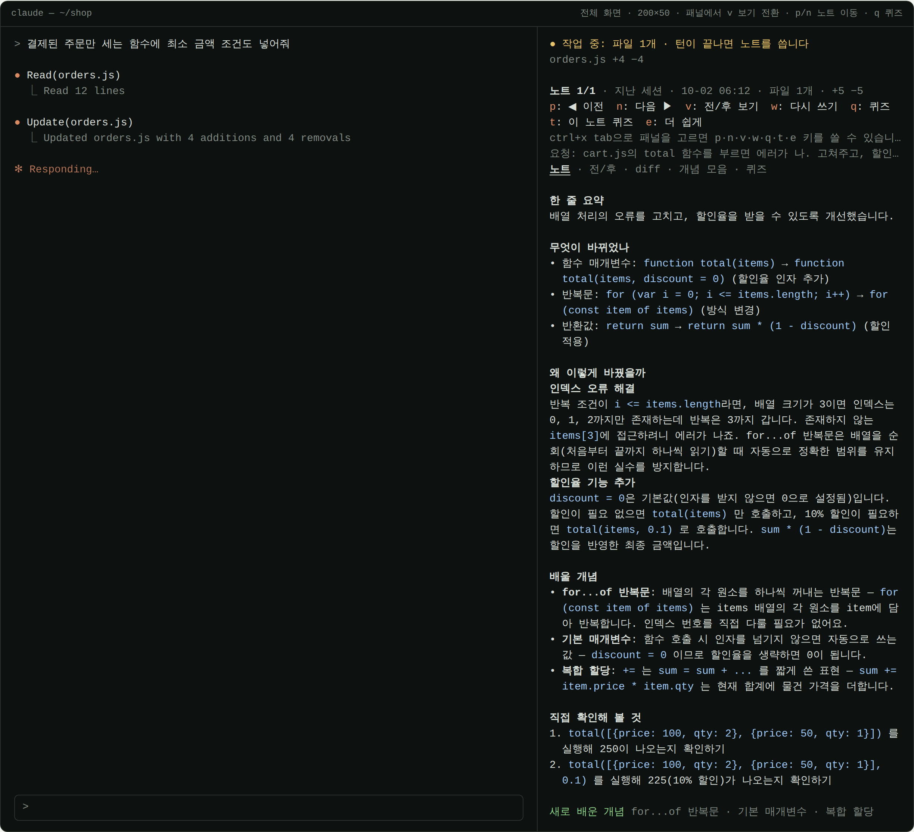
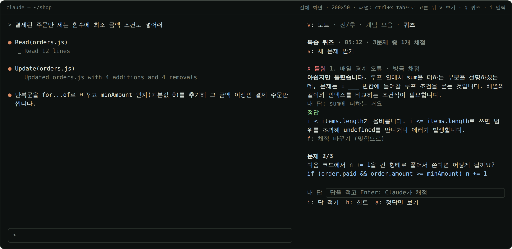

# learn-notes · 바이브코딩 학습 노트

Claude가 코드를 고치면 **바뀌기 전과 후**를 모아 두었다가, 턴이 끝날 때마다
"무엇이 왜 바뀌었고 무엇을 배울 수 있는지"를 **학습 노트**로 정리해 오른쪽 패널에 보여 주는
[Claude Code](https://code.claude.com) 모드(mod)입니다. 배운 개념은 프로젝트를 넘어 쌓이고,
잊을 때쯤 다시 묻는 **간격 반복 퀴즈**, 하루·한 주 정리, 연속 학습일 같은 **학습 기록**, **Anki 카드 내보내기**까지 이어집니다.



<sub>사용 흐름을 42초로 보여 주는 데모입니다. 장면마다 모드의 테스트 키트로 엔진이 실제로 그린 화면을 이어 붙였고, 노트 본문과 `/learn ask`의 답은 haiku가 실제로 쓴 글입니다.</sub>

> **English**: A Claude Code mod for learning while you vibe-code. Every turn in which Claude edits files,
> it collects the before/after diffs and has a small model (haiku by default) write a short study note:
> what changed, why, concepts to learn, and what to try yourself. Notes appear in a side pane, pile up in
> a daily Markdown journal, and feed a cross-project concept index with recaps and review quizzes.
> Notes are written in Korean.

| 노트 | 전/후 |
| --- | --- |
|  |  |
| **개념 모음** | **작업 중** |
|  |  |

<sub>스크린샷은 모드의 테스트 키트(`claude plugin test`)로 엔진이 그린 화면을 옮긴 것이고, 노트 본문은 haiku가 실제로 쓴 글입니다. 실제 터미널의 색과 글꼴은 조금 다릅니다.</sub>

## 설치

Claude Code **v2.1.287 이상**이 필요합니다 (`claude --version`).

Claude Code 안에서 두 줄을 입력합니다.

```
/plugin marketplace add Owen-YC/learn-notes
/plugin install learn-notes@learn-notes
```

터미널에서 바로 할 수도 있습니다.

```bash
claude plugin marketplace add Owen-YC/learn-notes
claude plugin install learn-notes@learn-notes
```

그다음 Claude Code를 다시 시작하고 이렇게 씁니다.

1. `/tui fullscreen`: 전체 화면으로 바꿉니다. 패널이 대화 오른쪽에 붙으려면 전체 화면이어야 합니다
   (또는 `CLAUDE_CODE_NO_FLICKER=1`을 켜고 시작).
2. `/learn`: 학습 노트 패널을 엽니다.
3. 평소처럼 코딩을 요청합니다. Claude가 파일을 고친 턴이 끝나면 몇 초 안에 노트가 뜹니다.

`/learn help`로 명령 목록을 볼 수 있으면 켜진 것입니다.

- **업데이트**: `/plugin`에서 learn-notes를 골라 업데이트하거나 `claude plugin update learn-notes@learn-notes`
- **지우기**: `claude plugin uninstall learn-notes@learn-notes` (일지 파일 `~/.claude/learning-notes/`는 남습니다)
- **설치 없이 한 번 써 보기**: 이 저장소를 받아 `claude --plugin-dir <저장소 경로>`로 시작합니다.
- **Windows**: PowerShell에서 `irm https://claude.ai/install.ps1 | iex`로 Claude Code를 설치한 뒤, 위 명령을 그대로 씁니다.
  Claude Code는 작업할 폴더에서 켜세요(`cd ~\practice` 뒤 `claude`). `C:\Windows\System32`에서 켜면 Claude가 다른 곳(바탕화면 등)에 파일을 만들게 됩니다.
  `claude`를 못 찾으면 새 창을 열거나 `$env:Path += ";$HOME\.local\bin"`을 입력하세요.

> 클라우드 세션(claude.ai의 웹·앱에서 여는 Claude Code 세션)에서는 패널이 보는 화면에 뜨지 않을 수 있습니다.
> 이때 `/learn`은 마지막 노트를 대화창에 적어 주고, `/learn last`로 언제든 다시 볼 수 있습니다.

## 무엇을 하나

1. Claude가 `Edit`·`Write`(그리고 파일을 바꾼 셸 명령: Bash, Windows에서는 PowerShell)를 쓸 때마다 그 변경의 diff를 모읍니다.
   셸 명령은 Claude Code가 diff를 주지 않으면(Windows의 PowerShell 등) 명령에 이름이 나온 파일을 명령 전후로 읽어 비교합니다. 스크립트 안에서만 쓰는 파일처럼 명령에 이름이 드러나지 않는 변경은 잡지 못합니다.
   노트의 "요청"은 사람이 보낸 요청입니다. 작업 알림이나 다른 세션의 메시지로 시작한 턴은 마지막 요청에 "(이어서)"를 붙여 보입니다.
   턴이 도는 동안에는 패널 맨 위에 "● 작업 중: 파일 n개"가 실시간으로 보입니다.
   이런 것은 모으지 않습니다. 내가 배울 코드가 아니기 때문입니다.
   - Claude가 스스로 쓰는 계획 파일·메모리(`~/.claude/plans`, `~/.claude/projects`)
   - 프로젝트 밖 임시 폴더(`/tmp`, `TMPDIR` 등)의 작업 파일
   - `git stash`·`checkout`·`restore`·`reset`·`pull`·`merge` 같은 git 명령이 디스크에 되돌리거나 가져온 내용
   이번 턴에 새로 만든 파일을 같은 턴에 다시 고치면, 지운 줄 없이 "새 파일" 하나로 마지막 내용을 보여 줍니다.
2. 턴이 끝나면 저렴한 모델(기본 `haiku`)이 diff와 내 요청, Claude의 마지막 설명을 읽고
   다섯 칸짜리 노트를 씁니다: **한 줄 요약 · 무엇이 바뀌었나 · 왜 이렇게 바꿨을까 · 배울 개념 · 직접 확인해 볼 것**.
3. 패널에서 `v`로 보기를 바꿉니다: **노트 → 전/후 → diff → 개념 모음 → 퀴즈**.
   - **전/후**: 바뀐 곳마다 "− 전(원래 코드)"과 "+ 후(바뀐 코드)"를 바뀐 줄과 앞뒤 한 줄만, 파일의 줄 번호 그대로 보여 줍니다.
   - **diff**: 익숙해지면 보는 원래 형식(+/− 줄)입니다.
4. 노트는 `~/.claude/learning-notes/<날짜>_<프로젝트>_<경로 표식>.md`에 차곡차곡 쌓입니다(diff 포함). 복습용 일지입니다.
   경로 표식은 프로젝트 경로에서 만든 짧은 글자라, 폴더 이름이 같은 다른 프로젝트와 섞이지 않습니다.
   하루 파일이 3MB를 넘으면 `~2.md`, `~3.md`로 이어집니다.

## 누적 관리

- **지난 세션 노트**: 프로젝트마다 최근 노트 30개(최근 프로젝트 12개까지)를 Claude Code의 플러그인 저장소에 보관합니다.
  새 세션을 열면 패널에 "지난 세션" 표시와 함께 다시 나옵니다. 노트를 쓰다 세션이 끝났으면 실패로 표시되고 `w`로 다시 쓸 수 있습니다.
  - 같은 프로젝트에서 세션 둘을 동시에 써도 서로의 노트를 지우지 않습니다. 같은 노트는 더 나중에 고친 쪽이 남습니다.
    (Claude Code의 플러그인 저장소는 `~/.claude/plugins/store/`의 파일로, 읽을 때마다 다른 프로세스가 쓴 값을 보고 키 단위로 씁니다. 두 `claude -p` 프로세스로 실측했습니다.)
  - `/cd`나 워크트리 이동으로 프로젝트가 바뀌면 패널이 그 프로젝트의 노트로 바뀝니다. 노트는 각자 자기 프로젝트에 남습니다.
  - 저장 공간을 약 2MB로 묶어, 넘으면 오래 안 쓴 프로젝트부터 덜어 냅니다. 저장이 실패하면 한 번 알려 줍니다(일지 파일은 그대로).
  - `claude -p` 실행에서는 턴이 끝날 때 노트를 다 쓰고 나서 끝납니다. 그만큼(보통 10초 안팎) 실행이 길어집니다.
- **배운 개념 모음**: 노트의 "배울 개념"을 프로젝트를 넘어 모읍니다. 개념마다 만난 횟수, 처음·마지막 날짜, 최근 설명, 최근 파일을 기록합니다.
  - 새 노트를 쓸 때 이미 배운 개념 이름을 모델에 알려 주므로, 같은 개념은 같은 이름으로 쌓이고 노트에 "(복습)"이 붙습니다.
  - 노트 아래에 그 노트 시점 기준으로 `새로 배운 개념`과 `복습한 개념 for...of 반복문 ×2`가 나뉘어 나옵니다.
  - 패널의 `개념 모음` 보기와 `/learn concepts`로 전체를 봅니다. 맨 위에 최근 7일 진도(새 개념 n개 · 복습 m개)와
    **복습할 개념**(복습할 때가 된 것, 틀린 것 먼저)과 학습 기록 한 줄(`연속 3일째 · 최근 7일 노트 12개 · 퀴즈 9/12 맞힘`)이 나옵니다.
    개념마다 `다음 복습 3일 뒤`처럼 다음 복습 날짜가 붙습니다. 아래 [간격 반복 복습](#간격-반복-복습)을 보세요.
  - 이 프로젝트에 노트가 아직 없어도, 다른 프로젝트에서 모은 개념은 패널에서 `v`로 볼 수 있습니다. 개념마다 그 개념이 나온 노트(날짜·파일)가 버튼으로 달려 있어 누르면 그 노트로 갑니다.
  - 일지 폴더의 `concepts.md`에 표로도 남습니다(자동 저장이 꺼져 있으면 `/learn save` 때).
  - 개념의 "최근 파일"은 그 개념 설명이 인용한 코드가 실제로 들어 있는 파일입니다(인용이 없으면 그 노트의 첫 파일).
  - "구조 분해 할당 (Destructuring)"과 "구조 분해 할당", "for...of"와 "for-of"처럼 표기만 다른 이름은 한 개념으로 셉니다.
  - 노트를 다시 쓰면 바뀐 개념만 고쳐 셉니다(같은 노트가 두 번 세지지 않습니다).

## 쓰는 법

| 명령 | 하는 일 |
| --- | --- |
| `/learn` | 학습 노트 패널 열기 (패널을 그릴 수 없는 화면이면 마지막 노트를 대화창에 출력. 클라우드 세션(웹·앱의 클라우드 환경)은 패널이 보는 화면에 뜨지 않을 수 있어 마지막 노트를 함께 출력) |
| `/learn last` | 마지막 노트를 대화창에 출력 |
| `/learn concepts` | 지금까지 배운 개념: 최근 7일 진도, 복습할 개념, 많이 만난 순 목록(다음 복습 날짜 포함) |
| `/learn recap` | 오늘 배운 것을 모델이 정리(한 일 · 핵심 개념 · 헷갈리기 쉬운 것 · 다음에 해 볼 것). `어제` · `이번주`(월요일부터) · `최근 7일` · 날짜도 됨. 일지 파일을 읽어 그날 노트를 빠짐없이 보고, 정리는 다룬 마지막 노트의 날짜 일지에 남김 |
| `/learn quiz` | 복습할 개념(없으면 곧 복습할 개념)에서 최대 3문제. 개념 이름을 감추고 코드와 상황으로 묻습니다 |
| `/learn quiz 정답` | 답을 보이고, 아직 채점하지 않은 문제는 맞힌 것으로 적습니다(그 개념은 다음 복습 단계로). 두 번째로 볼 때는 표시를 바꾸지 않습니다. 마지막 퀴즈는 저장되므로 Claude Code를 다시 켠 뒤에도 정답·틀림을 이어서 할 수 있습니다 |
| `/learn quiz 틀림 2` | 틀린 문제 번호(여럿도 됨: `틀림 1 3`)를 알리면 그 문제를 틀린 것으로 고치고, 개념을 복습할 개념 맨 앞에 올립니다 |
| `/learn ask 질문` | 패널에서 고른 노트(없으면 마지막 노트)에 대해 묻기. 노트와 그 diff를 근거로 짧게 답하고, 질문과 답을 일지에 남깁니다 |
| `/learn stats` | 학습 기록: 연속 학습일(가장 길었던 날 수), 최근 7일 노트·새 개념·퀴즈, 최근 30일 정답률, 날짜별 막대 |
| `/learn anki` | 지금까지 낸 퀴즈 문제(최근 300개)와 배운 개념을 Anki 카드 파일로 씁니다. 아래 [Anki로 내보내기](#anki로-내보내기) |
| `/learn find 말` | 모든 프로젝트의 노트에서 요청·노트 내용·파일 이름·개념(합친 이름 포함)으로 찾기. 이 프로젝트의 가장 최근 결과는 패널에서 골라 둠(`/learn`으로 열면 보임) |
| `/learn days` | 이 프로젝트의 일지가 있는 날짜 |
| `/learn day 2026-10-03` | 그날의 노트 목차(시각 · 요청 · 한 줄 요약). `오늘` · `어제`도 됨 |
| `/learn merge A = B` | 이름만 다른 같은 개념 합치기(A를 B로, `=` 대신 `=>` `->` `→` `\|`도 됨). 앞으로 노트에 A가 나와도 B로 셈. 한 노트가 둘 다 가르쳤으면 한 번만 셈. 거꾸로(`B = A`) 하면 되돌림: 두 개념을 합쳤던 것이면 원래 횟수대로 다시 나누고, 이름만 바꿨던 것이면 이름을 되돌림 |
| `/learn save` | 아직 파일에 저장되지 않은 노트와 개념 모음(concepts.md) 저장 |
| `/learn clear` | 이 프로젝트의 노트 비우기 (다음 세션에도, 다른 세션이 들고 있던 사본으로도 안 돌아옴 · 일지 파일과 개념 모음은 그대로) |
| `/learn help` | 하위 명령 목록 |

패널 안 단축키는 버튼 앞에 적혀 있습니다: `p` 이전 · `n` 다음 · `v` 보기 전환 · `w` 노트 쓰기/다시 쓰기 · `q` 퀴즈 · `t` 이 노트 퀴즈 · `e` 더 쉽게.
`p`·`n`으로 지난 세션 노트까지 거슬러 올라갈 수 있습니다.
터미널에서는 먼저 `ctrl+x tab`(또는 클릭)으로 패널을 골라야 키가 먹습니다.

### 패널에서 퀴즈 풀기

명령을 칠 필요 없이 패널 안에서 키 몇 개로 풉니다. `q`(또는 `v`로 넘기다 보면)로 **퀴즈** 보기를 엽니다.

| 키 | 하는 일 |
| --- | --- |
| `s` | 문제 받기: 복습할 개념(틀린 것 먼저, 오래 밀린 것 다음)부터 최대 3문제 (모델 호출 한 번) |
| `a` | 지금 문제의 정답 보기. 먼저 머릿속으로 답해 본 뒤 누릅니다 |
| `o` | 맞혔어요: 그 개념을 다음 복습 단계로 올립니다(더 나중에 다시 나옴) |
| `x` | 틀렸어요: 그 개념을 첫 단계로 돌리고 복습할 개념 맨 앞에 올립니다. 다음 퀴즈에 먼저 나옵니다 |
| `v` | 노트로 돌아가기 |

한 문제씩 나오고, 채점한 문제는 위에 `✓ 맞힘`·`✗ 틀림` 한 줄로 남습니다. 다 풀면 몇 개 맞혔는지 보여 줍니다.
퀴즈와 채점은 저장되므로 Claude Code를 다시 켜도 이어서 풉니다. `/learn quiz`로 받은 퀴즈도 패널에서 이어서 풀 수 있고, 반대도 됩니다.



### 노트에서 바로

노트 보기에서 키 하나로 이어 갑니다.

- `t` **이 노트 퀴즈**: 방금 읽은 노트의 개념만으로 문제를 받습니다. 바로 퀴즈 보기로 넘어갑니다.
- `e` **더 쉽게**: 노트가 어려우면 문장을 짧게, 용어를 일상어로, 개념마다 일상의 비유를 넣어 다시 씁니다. `w`로 원래 수준으로 다시 쓸 수 있습니다.
- `/learn ask 질문`: 노트를 읽다 궁금한 것을 묻습니다. 예: `/learn ask 왜 let 대신 const를 썼어?` 질문과 답은 그 노트가 있는 날의 일지에 남습니다.
  대화창의 Claude에게 묻는 것과 달리 코드를 고치지 않고, 노트와 그 diff만 보고 저렴한 모델이 짧게 답합니다.

### 간격 반복 복습

배운 개념은 **잊을 때쯤** 다시 나옵니다. 퀴즈에서 맞힐 때마다 간격이 늘어납니다.

| 단계 | 0 | 1 | 2 | 3 | 4 | 5 |
| --- | --- | --- | --- | --- | --- | --- |
| 다음 복습 | 1일 뒤 | 3일 뒤 | 7일 뒤 | 14일 뒤 | 30일 뒤 | 60일 뒤 |

- 복습할 때가 된 개념을 맞히면(`o`, 또는 `/learn quiz 정답` 뒤 틀림이라고 하지 않으면) 한 단계 오릅니다. 때가 되기 전에 맞힌 것(`t`로 푼 방금 배운 개념 등)이나 같은 날 다시 맞힌 것은 단계를 그대로 두고 그날부터 다시 셉니다.
- 틀리면(`x`, `/learn quiz 틀림`) 0단계로 돌아가 **바로** 복습할 개념 맨 앞에 옵니다.
- 퀴즈를 아직 안 본 개념은 노트에서 다시 만난 횟수만큼 단계가 올라 있는 것으로 칩니다(한 번 배운 개념은 다음 날 복습).
- 복습할 때가 된 개념이 있으면 프롬프트 아래 상태줄에 `학습 노트 · 복습할 개념 3개 · /learn 패널에서 q`가 뜹니다. 끄려면 설정의 `reviewReminder`.

### 학습 기록

노트를 쓴 날과 퀴즈를 채점한 날이 날짜별로 쌓입니다(최근 120일, 모든 프로젝트 합산).
개념 모음 맨 위와 `/learn stats`에서 **연속 학습일**, 최근 7일 노트·새 개념·퀴즈, 최근 30일 정답률을 봅니다.
노트를 다시 쓰거나 더 쉽게 쓴 것은 새 노트로 세지 않습니다.

### Anki로 내보내기

`/learn anki`가 일지 폴더(기본 `~/.claude/learning-notes`)에 `learn-notes-anki.txt`를 씁니다.

1. [Anki](https://apps.ankiweb.net) 데스크톱에서 **파일 → 가져오기**로 이 파일을 고릅니다. 덱(`learn-notes`)과 태그는 파일에 적혀 있고, 노트 유형은 기본(Basic)으로 두면 됩니다.
2. 카드 앞면은 퀴즈 문제(또는 개념 이름), 뒷면은 답과 개념입니다. 코드는 코드 글꼴로 보입니다.
3. 휴대폰 AnkiDroid·AnkiMobile은 동기화하면 같이 보입니다.

다시 내보내 가져와도 앞면이 같은 카드는 늘지 않고 고쳐집니다.

전체 화면 터미널에서는 패널이 **오른쪽에 붙고**, 아니면 프롬프트 위에 열립니다.
첫 노트가 생길 때 패널이 저절로 열리는 것은 **전체 화면 터미널이면서 144칸 이상일 때, 세션마다 한 번**뿐입니다.
그 밖에는 노트가 준비되면 토스트(`학습 노트: … · /learn으로 보기`)로 알려 줍니다.

## 설정

`/config`의 `learn-notes.…` 항목에서 바꾸거나, `/plugin configure learn-notes@learn-notes`(터미널에서는 `claude plugin configure learn-notes@learn-notes`)로 바꿉니다.
설치할 때 `--config model=sonnet`처럼 줄 수도 있습니다. 비워 두면 아래 기본값을 씁니다.

| 항목 | 기본값 | 설명 |
| --- | --- | --- |
| `autoNote` | 켜짐 | 끄면 diff만 모으고 노트는 패널에서 `w`로만 씁니다 (모델 비용 0) |
| `model` | `haiku` | `haiku` · `sonnet` · `opus` |
| `level` | `beginner` | `beginner`(용어를 쉬운 말로) · `intermediate` · `advanced`(설계·트레이드오프) |
| `autoOpen` | 켜짐 | 첫 노트에서 패널 자동 열기 (전체 화면 터미널에서만) |
| `autoSave` | 켜짐 | 노트를 마크다운 일지로 저장 |
| `reviewReminder` | 켜짐 | 복습할 개념이 있으면 상태줄에 개수를 띄움 |
| `saveDir` | (비움) | 비우면 `~/.claude/learning-notes`. `~`로 시작하면 홈 폴더 기준 |

## 노트를 못 쓸 때

패널에 이유가 빨간 글씨로 나옵니다. `w`로 다시 쓸 수 있습니다.

- `서버가 붐빕니다` · `요청 한도에 걸렸습니다`: 잠시 뒤 다시 쓰기
- `'…' 모델을 부를 수 없습니다`: 조직 정책 등으로 그 모델이 막혀 있습니다. `/config`에서 다른 모델을 고르세요
- `노트 쓰기가 멈췄습니다`: 노트를 쓰는 도중에 모드를 다시 불러온 경우입니다. `w`로 다시 쓰세요

## 비용과 개인정보

- 파일을 바꾼 턴마다 모델 호출이 **한 번** 일어납니다 (기본 haiku, 노트 하나에 diff 최대 약 14,000자). `/learn recap`·`/learn quiz`·`/learn ask`(패널의 `s`·`t`·`e`도)는 부를 때마다 한 번입니다. `/learn stats`·`/learn anki`는 모델을 부르지 않습니다.
  호출은 지금 쓰는 Claude Code 계정·키로 나갑니다.
- diff와 요청 문장이 그 모델 호출에 실립니다. 비밀값이 든 파일을 고치는 작업이라면 `autoNote`를 끄세요.
- 노트 파일과 지난 세션 노트·개념 모음·학습 기록·퀴즈 문제는 내 컴퓨터에만 저장됩니다.

## 개발

```
.claude-plugin/plugin.json        매니페스트 · 설정 항목(userConfig)
.claude-plugin/marketplace.json   이 저장소를 마켓플레이스로 쓰게 하는 목록
hooks/hooks.json                  훅 모듈 위치
hooks/register.tsx                훅: 변경 수집 · 노트 작성 · 패널 · /learn
hooks/notes.ts                    순수 함수: diff 자르기·되읽기 · 전/후 분리 · 노트 프롬프트 · 일지 마크다운
types/index.d.ts                  $.state 계약
tests/*.test.ts                   claude plugin test로 도는 검사
```

- 검사: `claude plugin validate .` · `claude plugin test .`
- 고쳐 보며 쓰기: `claude --plugin-dir .`로 열면 파일을 고칠 때마다 대화 중에도 다시 불러옵니다.
- 편집기의 타입 검사는 `tsconfig.json`이 가리키는 `.claude-plugin/types/`(Claude Code가 모드 작업 폴더에 만들어 두는 타입 정의)가 있을 때 `npx tsc --noEmit -p .`로 돌립니다.

버그나 제안은 [Issues](https://github.com/Owen-YC/learn-notes/issues)에 남겨 주세요.

## 라이선스

[MIT](LICENSE)
